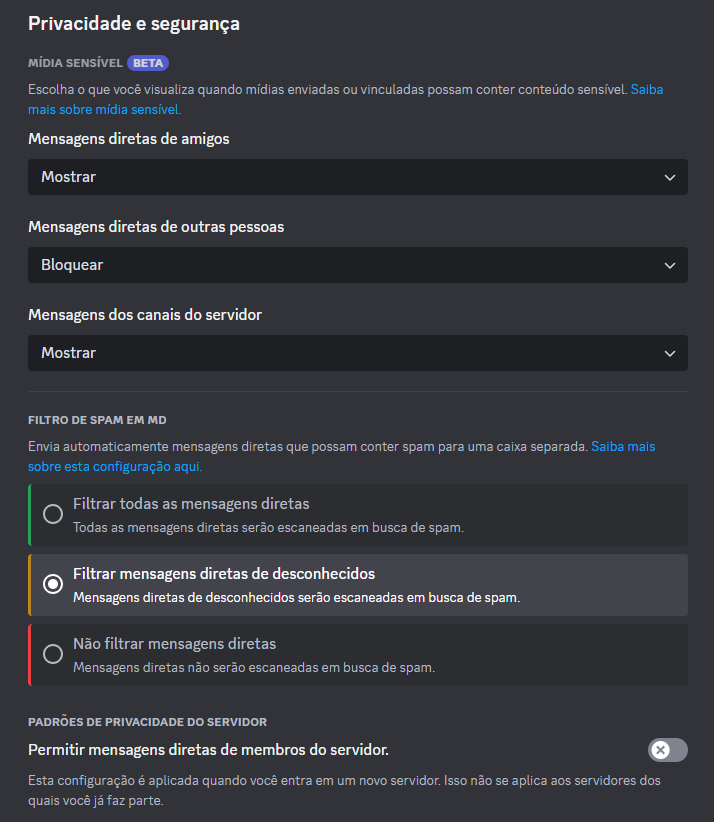
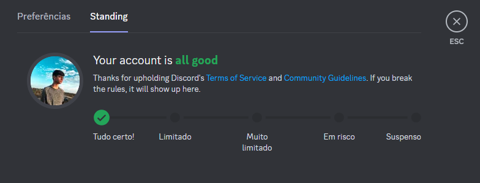
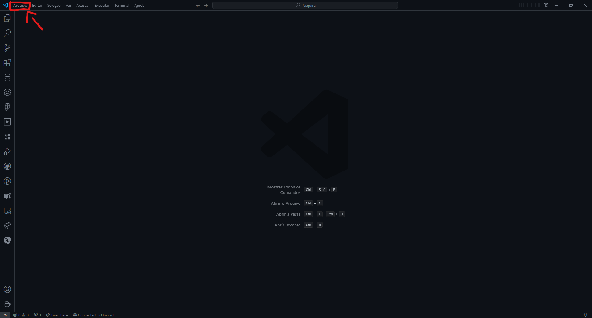
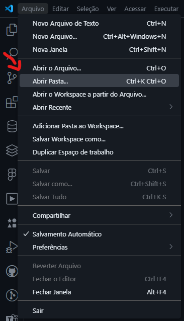

 
 

# Guia de configurações e instalações para criar um Bot no Discord

> 👤 Documentação criada por [**`Nicholas Emery`**](https://github.com/NicholasEmery).

# 📋 Sumário

  - [✍ Configurações Importantes](#-configurações-importantes)
    - [☑️ Requisitos](#️-requisitos)
    - [📋 Instalações](#-instalações)

# ✍ Configurações Importantes
### ☑️ Requisitos

- Ter o [Visual Studio Code](https://code.visualstudio.com/) instalado na sua máquina e na da sua equipe. ⚠️ De preferência a versão de `x64` bits, para um melhor desempenho. ⚠️
- Ter o [NodeJS](https://nodejs.org) instalado na sua máquina e na da sua equipe. ⚠️ É recomendado instalar a versão LTS `20.x.x` para evitar possíveis erros. ⚠️
    - Bibliotecas necessárias
        - [discord.js](https://discord.js.org/) com versão `14.14.1` ou superior.
        - [dotenv](https://www.npmjs.com/package/dotenv) com versão `16.4.5` ou superior.
- Ter o [Git](https://git-scm.com/) instalado e configurado com o [GitHub](https://github.com/).
- Ter o [Discord](https://discord.com/download) instalado na sua máquina e ter uma conta criada.
- Ter sincronizado sua conta do Discord com o [Discord Developer Portal](https://discord.com/developers/applications).
    - Questões de Segurança dos Bots.
        - Sua conta do Discord precisa estar com a autenticação por SMS ativada.
        - Habilitar a 2FA ([Autenticação de 2 Fatores](https://etechpt.com/como-ativar-ou-desativar-a-autenticacao-de-dois-fatores-2fa-no-discord/#:~:text=Ativar%202FA%20no%20Discord%20%28Android%20e%20iOS%29%201,de%20dois%20fatores%20em%20sua%20conta%20Discord.%20)) na sua conta do Discord.
        - Sua conta do Discord precisa estar com essas configurações de privacidade e segurança👇
        - No final, a sua conta do Discord precisa estar assim. Para avançar👇 

### 📋 Instalações

- Comece pelo o [Git](https://git-scm.com/).
    - [Guia de instalação do Git](https://kinsta.com/pt/base-de-conhecimento/instalar-git/).
    - Configure-o com o comando `git config -- global user.name "Seu Nome"` e `git config --global user.email "seuemail@exemplo.com"` para configurar seu nome e email do github.
- Depois instale o [Visual Studio Code](https://code.visualstudio.com/Download) na sua máquina.
    - [Guia de Instalação do VSCODE](https://www.devmedia.com.br/guia-completo-do-visual-studio-code/43827).
- Agora instale o [NodeJS](https://nodejs.org) na sua máquina.
    - [Guia de instalação do NodeJS](https://www.alura.com.br/artigos/como-instalar-node-js-windows-linux-macos).
        - Instalação das bibliotecas necessárias para o projeto.
            - Abra o seu [Visual Studio Code](https://code.visualstudio.com) e clique em `Arquivo` na aba de cima👇
            
                
            - Agora vá em `Abrir Pasta...`👇 e selecione a pasta que você criou para o seu bot.
            
                
            - Agora, abra o seu terminal pelo o [Visual Studio Code](https://code.visualstudio.com) apertando as teclas `Ctrl+⬆️Shift+'`.
            - Agora, instale o [discord.js](https://discord.js.org/) com esse comando `npm install discord.js` no terminal.
            - Depois, instale o [dotenv](https://www.npmjs.com/package/dotenv) com o comando `npm install dotenv` no terminal.
- Após isso, instale o [Discord](https://discord.com/download) na sua máquina.
    - [Guia de instalação do Discord](https://support.discord.com/hc/pt-br/articles/360034561191-Guia-de-Instala%C3%A7%C3%A3o-do-Desktop).
